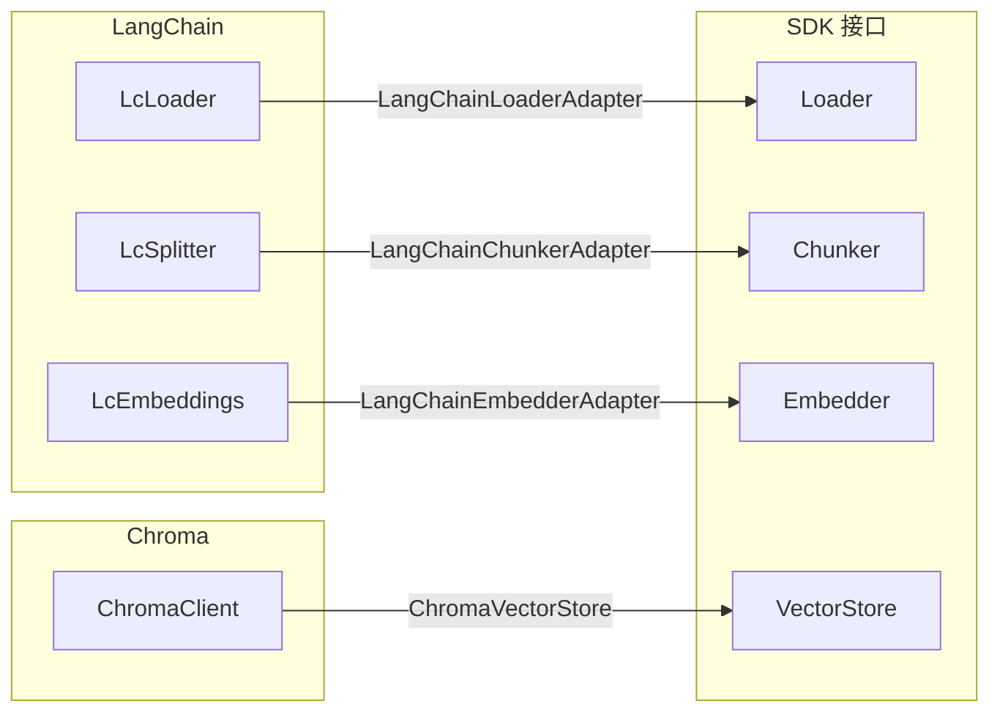

# Adapters 包

外部服务适配器。将 LangChain、Chroma 等外部生态的能力转换为 SDK 内部接口。

## 职责

- 按外部生态组织目录（langchain/、chroma/）
- 使用结构类型抽象第三方接口（零第三方运行时依赖）
- 提供预设 chunker（RecursiveChunker、TokenChunker、MarkdownChunker）
- 共享元数据归一化逻辑

## 目录结构

```
src/
  shared/                     跨生态通用逻辑
    metadata.ts               normalizeMetadataValue、normalizeMetadata、mergeMetadata
  langchain/                  LangChain 适配线
    shared/                   LC 专属映射
      document-mapper.ts      LcDocumentLike、文档互转
      chunk-mapper.ts         lcDocumentToChunk
      id.ts                   generateFallbackId
    loaders/
      langchain-loader-adapter.ts    LangChainLoaderAdapter
      markdown-directory-loader.ts   MarkdownDirectoryLoader（支持 FileSystem 注入）
    chunkers/
      langchain-chunker-adapter.ts   LangChainChunkerAdapter + SplitterLike
      presets.ts                      RecursiveChunker、TokenChunker、MarkdownChunker
    embedders/
      langchain-embedder-adapter.ts  LangChainEmbedderAdapter
  chroma/                     Chroma 适配线
    stores/
      chroma-vector-store.ts  ChromaVectorStore
  index.ts                    公共 API 导出
__tests__/                    单元测试
```

## 适配关系


