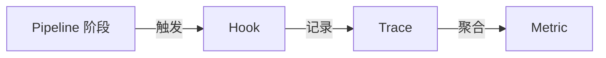

# Observability 包

可观测性层。提供钩子、追踪和指标能力，作为横切关注点被其他包引用。

## 职责

- 定义 Hook 扩展点，允许在管线阶段注入自定义逻辑
- 记录 Trace（一次管线执行的完整追踪）
- 从 Trace 聚合 Metric（延迟、吞吐量、错误率）

## 目录结构

```
src/
  index.ts        公共 API 导出
```

## 数据流


