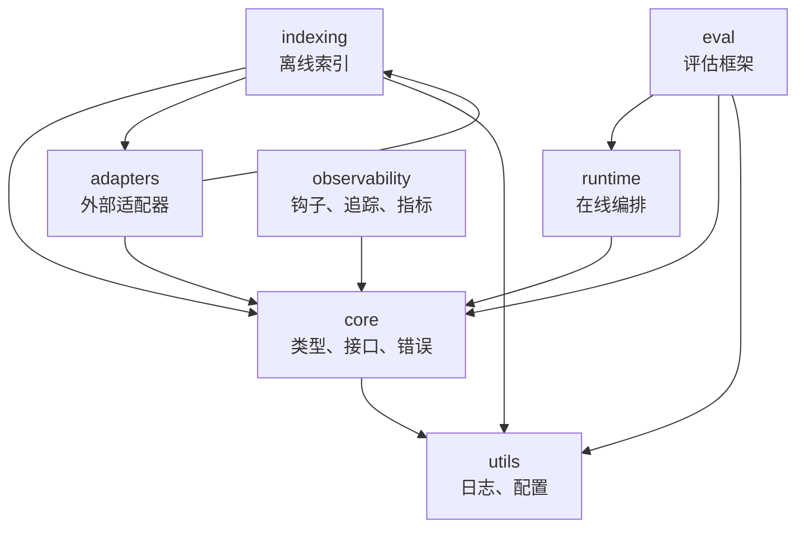
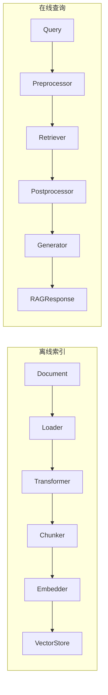

# 架构总览

RAG SDK 是一个 TypeScript pnpm monorepo，包含 7 个包分组。

## 包拓扑

## 依赖关系

| 包 | 依赖 | 职责 |
|---|---|---|
| `utils` | 无 | 日志、配置、辅助函数 |
| `core` | utils | 共享数据类型（Document, Chunk, Vector, Query）、Zod Schema、接口定义、错误类型 |
| `runtime` | core | 在线查询编排：pre-retrieval → retrieval → post-retrieval → generation |
| `indexing` | core, adapters, utils | 离线索引构建：load → transform → chunk → embed → store |
| `adapters` | core, indexing | 外部服务适配器（LangChain、Chroma 等） |
| `observability` | core | 横切关注点：钩子、追踪、指标 |
| `eval` | runtime, core, utils | 评估框架：数据集、运行器、评判器、指标 |

## 核心数据流

