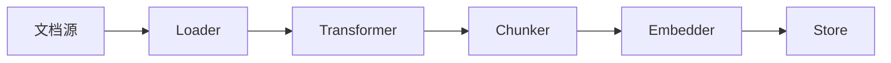

# 索引流程

离线数据构建流水线，将原始文档加工为可检索的向量索引。

```mermaid
graph LR
    A[文档源] --> B[Loader]
    B --> C[Transformer]
    C --> D[Chunker]
    D --> E[Embedder]
    E --> F[Store]
```

默认组件：`MarkdownLoader`、`SimpleChunker`、`MockEmbedder`、`MemoryVectorStore`。用法见 `packages/indexing/demo/`。
